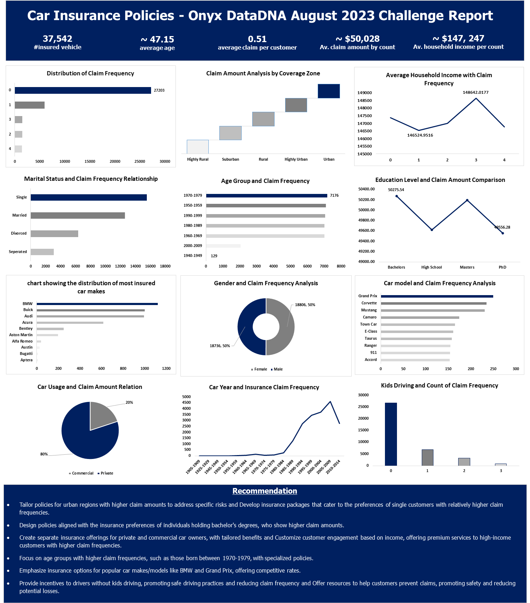

# Car Insurance Data Analysis

## Introduction

This repository contains an analysis of car insurance policies data, aimed at deriving insights to improve our insurance offerings and services. The dataset includes information on customer demographics, car details, claim frequencies, and claim amounts. The analysis focuses on understanding trends, relationships, and patterns within the data.

## Contents

- `data/`: Contains the raw car insurance policies data in CSV format.
- `notebooks/`: Includes Jupyter notebooks with the data analysis, insights generation, and visualization steps.
- `visualizations/`: Contains visualizations generated during the analysis.
## Visualization

## Insights

1. **Claim Frequency Distribution:**
   - Majority of customers have 0 claims, while a few have up to 4 claims.

2. **Claim Amounts by Coverage Zone:**
   - Urban regions have the highest sum of claim amounts.

3. **Marital Status and Claim Frequency:**
   - Singles tend to have higher claim frequencies.

4. **Education Level and Claim Amounts:**
   - Customers with bachelor's degrees exhibit higher claim amounts.

5. **Gender and Claim Frequency:**
   - Female customers show slightly higher claim counts.

6. **Private vs. Commercial Claims:**
   - Majority of claim amounts are from private car owners.

7. **Income and Claim Frequency:**
   - There is a slight correlation between average income and claim frequency.

8. **Age Group and Claim Frequency:**
   - Customers born between 1970-1979 have the highest claim frequency.

9. **Popular Car Makes and Models:**
   - BMW and Grand Prix are the most insured car makes/models.

10. **Kids Driving and Claim Frequency:**
    - Customers without kids driving show higher claim frequencies.

## Recommendations

- **Policy Customization for Coverage Zones:** Tailor policies to address specific risks in urban regions.
- **Catering to Singles' Needs:** Design packages catering to preferences of single customers.
- **Education-Based Offerings:** Develop policies aligning with preferences of bachelor's degree holders.
- **Gender-Centric Approach:** Implement marketing and features for female customers.
- **Differential Coverage for Private and Commercial Owners:** Create distinct policies for private and commercial owners.
- **Segmented Engagement by Income:** Customize engagement for high-income customers.
- **Age-Group-Specific Policies:** Focus on specialized policies for age groups with higher claim frequencies.
- **Highlight Popular Car Models:** Emphasize insurance options for popular car makes/models.
- **Incentives for Safe Driving:** Provide rewards for safe driving practices.
- **Focus on Mid-2000s Cars:** Tailor policies for cars manufactured between 2005 and 2009.

## Usage

1. Clone this repository: `git clone https://github.com/yourusername/car-insurance-analysis.git`
2. Explore the notebooks in the `notebooks/` directory for detailed analysis steps.
3. Check out the visualizations in the `visualizations/` directory.
4. Adapt the insights and recommendations for your insurance business strategy.

## Credits

Data provided by [Insurance Data Corp](https://www.onyxdata.co.uk).

## License

This project is licensed under the [MIT License](LICENSE).
